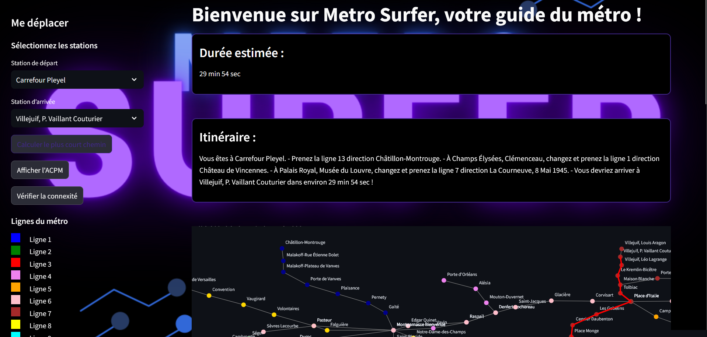

# Metro Surfer

Lien vers le site : https://sharu2501-metro-runner-app-ohogzy.streamlit.app/

Vas-y dans le métro - DURAND Ugo, GUERIN Nam Luân, SASIKUMAR Sahkana
Projet en théorie des graphes pour Efrei Paris, 2024

Ce projet applique les concepts de théorie des graphes pour explorer le réseau du métro parisien.
Il permet de vérifier la connexité, de calculer le plus court chemin entre deux stations et de générer
un arbre couvrant de poids minimal.

## Lancement du Projet
Allez sur le site https://sharu2501-metro-runner-app-ohogzy.streamlit.app/

### Fonctionnalités présentes :

- Interface Graphique :
  - Carte du métro de paris navigable (zoom, dezoom, déplacement sur la carte, enregistrement sous format png...)
  - Bouton "Afficher le chemin" : Affiche le plus court chemin entre deux stations
  - Bouton "Arbre couvrant du graphe" : Affiche l’arbre couvrant minimal du réseau
  - Bouton "Vérifier la connexité" : Vérifie la connexité du graphe

## Architecture du code source :

- Dossier data : Les fichiers station.txt, liaison.txt et pospoints.txt dans le dossier data. Ils sont necessaires pour le chargement de données (position des stations dans l'espace, liens entre les différentes stations,...).
- Dossier utils : Les classes algorithmes.py, chargement_donnees.py et visualisation.py sont dans le dossier utils. 
Ils permettent de construire le graphe, effectuer des calculs de plus court chemin avec différents algorithmes et permettent de les visualiser sur une interface graphique.
- Dossier images : L'image MetroSurfer.png et le gif metro.gif sont dans le dossier images. Ils permettent d'améliorer l'ergonomie du site web.
- app.py : Cette classe est la classe principale où le graphe est construit, avec des appels d'algorithmes tel que Bellman-Ford et prim. Enfin on appelle les fonctions pour une visualisation graphique et une interface interactive facile d'utilisation.

## Scénario :

### Afficher le chemin le plus court entre la station Carrefour Pleyel et Villejuif, P. Vaillant Couturier :
- Cliquez sur la flèche en haut à gauche de la fenêtre si l'affichage de l'interface utilisateur pour l'entrée des stations n'est pas déjà affiché.
- Dans la liste de départ déroulante à gauche, tapez et cliquez sur la station Carrefour Pleyel. 
- Faire de même pour la station d'arrivée en tapant et cliquant sur la station Villejuif, P. Vaillant Couturier.
- Ensuite, cliquez sur le bouton Calculer le plus court chemin.
- Vous devriez maintenant avoir l'affichage suivant :

Durée estimée : 29 min 54 sec

Itinéraire :
Vous êtes à Carrefour Pleyel.
Prenez la ligne 13 direction Châtillon-Montrouge. 
À Champs Élysées, Clémenceau, changez et prenez la ligne 1 direction Château de Vincennes. 
À Palais Royal, Musée du Louvre, changez et prenez la ligne 7 direction La Courneuve, 8 Mai 1945. 
Vous devriez arriver à Villejuif, P. Vaillant Couturier dans environ 29 min 54 sec !

Le plus court chemin entre ces 2 stations en rouge s'affiche sur la carte dorénavant mise à jour avec un zoom sur la zone concernée.

### Afficher l'APCM :
- Cliquez sur le bouton Afficher l'ACPM
- L'arbre couvrant minimal s'affiche sur la carte suivie de son temps total soit l'affichage suivant :

Durée totale : 5 h 39 min 21 sec

### Vérifier la connexité du graphe :
- Cliquez sur le bouton Vérifier la connexité
- Un message de succès ou d'erreur s'affichera en bas de page pour indiquer la connexité du graphe.
Dans notre cas vous aurez l'affichage suivant : 

Vérification de la connexité
Le graphe est connexe : toutes les stations sont accessibles !

Nous vous souhaitons une bonne navigation !
